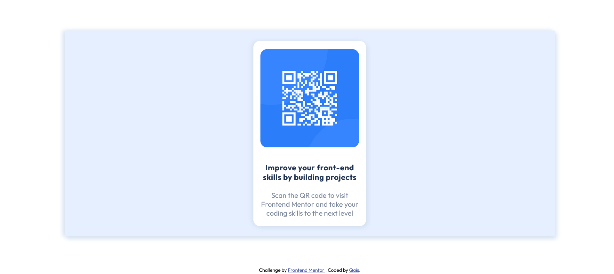
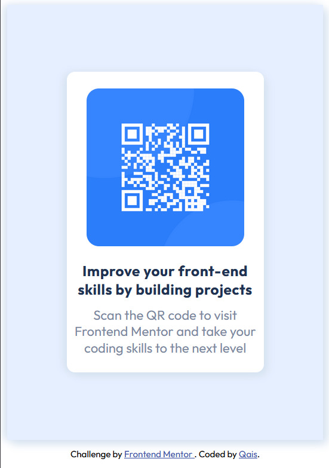

# Frontend Mentor - QR code component solution

This is a solution to the [QR code component challenge on Frontend Mentor](https://www.frontendmentor.io/challenges/qr-code-component-iux_sIO_H). Frontend Mentor challenges help you improve your coding skills by building realistic projects.

## Table of contents

- [Overview](#overview)
  - [Screenshot](#screenshot)
  - [Links](#links)
- [My process](#my-process)
  - [Built with](#built-with)
  - [What I learned](#what-i-learned)
  - [Continued development](#continued-development)
  - [Useful resources](#useful-resources)
- [Author](#author)

## Overview

The main challenge here was to position the elements correctly and to get them to look as close to preview as possible.

### Screenshot

### Links

- Solution URL: [Github](https://github.com/wqais/Front-End-Mentor/tree/main/01-%20QR%20Code)

## My process

I started with the desktop view first and then went on to work on the mobile view. Arranging the elements was the main challenge here so after a quick CSS refresher I was able to get them in the right positions. I managed to finish the challenge in 1 hour.

### Built with

- Semantic HTML5 markup
- CSS custom properties
- Flexbox

### What I learned

This was my first ever front end challenge so I learnt a lot of new things!
Firstly, I got a good understaning about the 'position' property in CSS. I used relative and absolute positions to align a 'div' inside another 'div'.
Then, I learnt the CSS 'box-shadow' property which I'm sure will come in handy for several of my upcoming projects.
Lastly, this is my first ever detailed 'Readme' file so the the tempelate provided by Front End Mentor was definitely useful!

### Continued development

Making responsive websites is something I would like to focus more on, I have a good idea of how to do it but would like to practice more of it!

### Useful resources

- Web Dev Simplified - [YouTube](https://wqaisportfolio.netlify.app) helped me in understanding CSS Positions!

## Author

- Website - [Qais Warekar](https://wqaisportfolio.netlify.app)
- Frontend Mentor - [@wqais](https://www.frontendmentor.io/profile/yourusername)
- Twitter - [@QWarekar](https://mobile.twitter.com/QWarekar)
